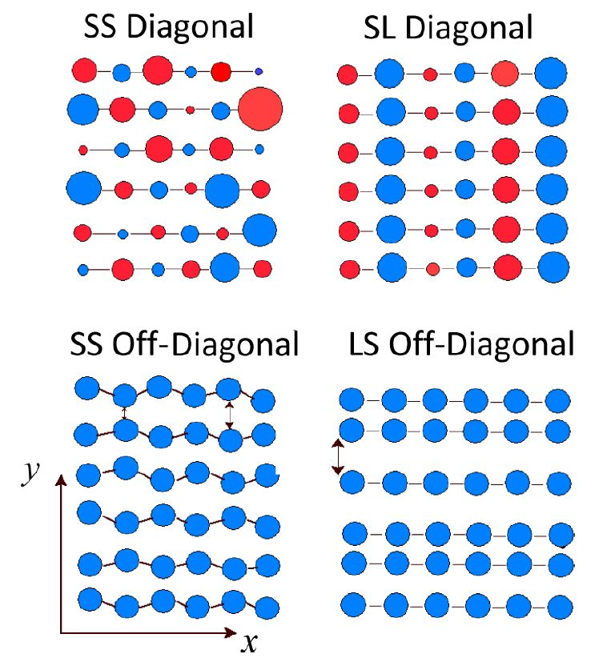

    
          ---------------------------------------------------
          |  Polaron Coherence in Conjugated Polymer Films  |
          
                            Author: Raja Ghosh
                            contact: raja.ghosh@temple.edu
          ---------------------------------------------------

What is it?
-----------

We develop a theory describing the spatial coherence of polarons (holes) in disordered conjugated polymer films. The program calculates the Charge Modulation Spectrum in the near IR and the mid-IR region for a 2 Dimensional molecular aggregate by solving the Holstein Hamiltonian employing a multiparticle basis set. 

Modeling Disorder in Polymer Aggregates
----------------------------------------

Energetic disorder in polymer films arises from variations in nearest neighbor packing distances, changes in intramolecular torsional angles and the presence of spatially fluctuating electric fields. We introduce various kinds of diagonal and offdiagonal disorder. Please look into the references mentioned below to have a better understanding of the different types of disorder models that have been implemented in the code. 

Polaron Absorption and Coherence 
----------------------------------------

We focus our attention entirely on the far to mid-IR transitions between the polaron ground state, lowest eigenfunction of the Hamiltonian and all the excited polaron states. We have developed a simple relationship between the oscillator strength of the mid-IR absorption band and the polaron coherence function. To put it simply, given an absorption spectrum, we can extract the polaron delocalization lengths both along the polymer backbone and in between chains. The subroutine to calculate the polaron absorption and coherence has been included in this repository. Please have a look and let me know if you have any questions.

MPI  
----

The polaron absorption spectrum needs to be averaged over several thousand configurations to obtain absolute convergence. The code uses MPI to parallely run the disorder configurations over multiple processors on a single node or over multiple nodes.

    
References
----------

Please go through the following references for detailed understanding of the model. Let me know if you any questions regarding the model. Please send an email to raja.ghosh@temple.edu. If you use this program please cite the following papers.

1. Ghosh, R.; Pochas, C. M.; Spano, F. C. Polaron Delocalization in Conjugated Polymer Films. J. Phys. Chem. C 2016, 120, 11394−11406.

2. Ghosh, R.; Chew, A.R.; Onorato, J.; Pakhnyuk, V.; Luscombe, C. K.; Salleo, A.; Spano, F.C.,Spectral Signatures and Spatial Coherence of Bound and Unbound Polarons in P3HT Films: Theory vs Experiment", J. Phys. Chem. C 2018, 122 (18048).

3. Pochas, C. M.; Spano, F. C. New Insights on the Nature of Two-Dimensional Polarons in Semiconducting Polymers: Infrared
Absorption in Poly(3-Hexylthiophene). J. Chem. Phys. 2014, 140, 244902
